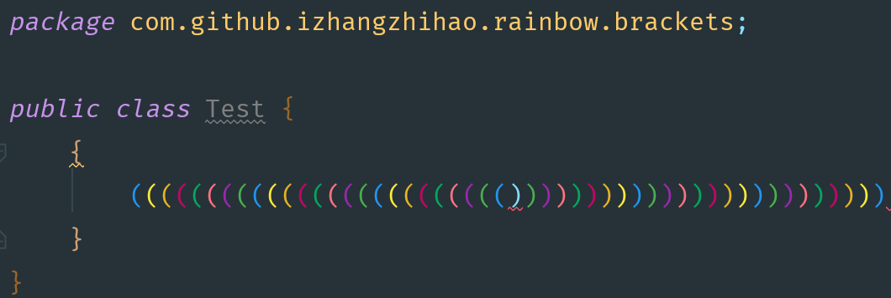

# Rainbow Brackets
     

## Rainbow Brackets / Rainbow Parentheses for IntelliJ IDEA-based IDEs

## Compatible with

IntelliJ IDEA, PhpStorm, WebStorm, PyCharm, RubyMine, AppCode, CLion, Gogland, DataGrip, Rider, MPS, Android Studio

## Supported languages

Java, Scala, Clojure, Kotlin, Python, Haskell, Agda, Rust, JavaScript, TypeScript, Erlang, Go, Groovy, Ruby, Elixir, ObjectiveC, PHP, C#, HTML, XML, SQL, Apex language ...

## This plugin is also compatible with [material-theme-jetbrains-eap](https://github.com/mallowigi/material-theme-jetbrains-eap)

## Screenshots

* with material-theme-jetbrains-eap

* with scala

* with kotlin

* with HTML/XML

* and more...

## Install

https://plugins.jetbrains.com/plugin/10080-rainbow-brackets

## Implement for some language you would like

1. Check [this commit](https://github.com/izhangzhihao/intellij-rainbow-brackets/commit/729eff116b5eb7dd93261d1476d4db305accffb1) for implementation for scala or check out [this commit](https://github.com/izhangzhihao/intellij-rainbow-brackets/commit/95489f599de1e4f536cfc4caf2e730fb63b765eb) for implementation for javascript.
2. Found the **language ID** such as `Scala`
3. Implement `RainbowScala` which is a class implement `Annotator`, you should know the `TokenTypes` of your language, such as [ScalaTokenTypes](https://github.com/JetBrains/intellij-scala/blob/idea173.x/scala/scala-impl/src/org/jetbrains/plugins/scala/lang/lexer/ScalaTokenTypes.java). 
And find out the `myDebugName` of your `IElementType`, in scala, we have:

|    IElementType    | bracket | myDebugName |
| :----------: | :---: | :---: |
| tLSQBRACKET | [ | [ |
| tRSQBRACKET | ] | ] |
| tLBRACE | { | { |
| tRBRACE | } | } |
| tLPARENTHESIS | ( | ( |
| tRPARENTHESIS | ) | ) |
| tLESS | < | < |
| tGREATER | > | > |

So you could use `myDebugName` as parameter pass to `annotateUtil`

4. Add your language id to `specLangList` so we can ignore common annotator.
5. Remove old annotator implement in `plugin.xml` and add your new !
6. `gradle runIde` check your awesome work !
7. Sent PR.

## Contribute

* `gradle runIde`
* `gradle buildPlugin`

## Acknowledgements

Intellij-rainbow-brackets is heavily inspired by [intellij-rainbow](https://github.com/zjhmale/intellij-rainbow) and [Rainbow Brackets for Visual Studio Code](https://marketplace.visualstudio.com/items?itemName=2gua.rainbow-brackets)
